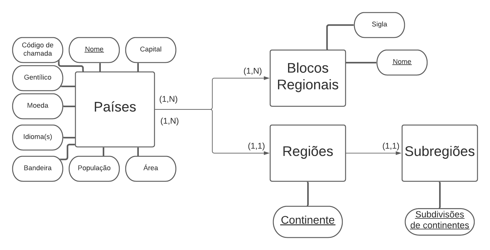
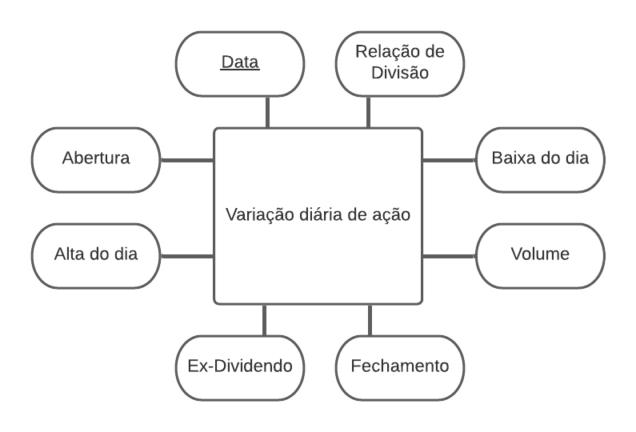

# Aluno
* André Vila Nova Wagner da Costa

# RA
* 213081

## Lab 01
* Link para o notebook jupyter com solução da Tarefa 1
> 

* Diagrama da divisão de países em regiões e subregiões, bem como suas características
> 

* Diagrama com informações sobre a variação diária de uma ação no mercado de ações
> > 
