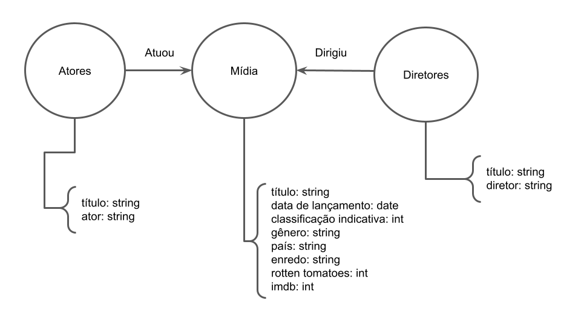

# Aluno
* `213081`: `André Vila Nova Wagner da Costa`

## Modelo Lógico do Banco de Dados de Grafos
> 

> 

> 

## Perguntas de Pesquisa/análise

> Liste aqui as três perguntas de pesquisa/análise
> * Pergunta 1
> * Pergunta 2
> * Pergunta 3
