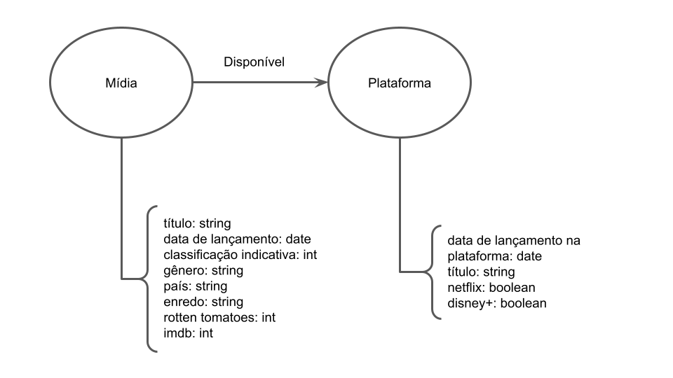
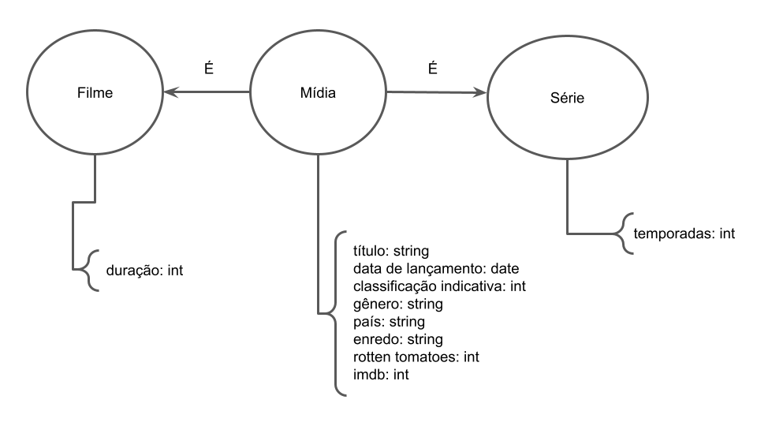

# Aluno
* `213081`: `André Vila Nova Wagner da Costa`

## Modelo Lógico do Banco de Dados de Grafos
> Utilize este [modelo de base](https://docs.google.com/presentation/d/10RN7bDKUka_Ro2_41WyEE76Wxm4AioiJOrsh6BRY3Kk/edit?usp=sharing) para construir o seu.
> Coloque a imagem do PNG do seu modelo lógico como ilustrado abaixo (a imagem estará na pasta `image`):
>
> 

> 

## Perguntas de Pesquisa/análise

> Liste aqui as três perguntas de pesquisa/análise
> * Pergunta 1
> * Pergunta 2
> * Pergunta 3
