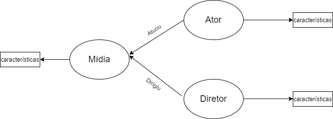

# Aluno
* `213081`: `André Vila Nova Wagner da Costa`

## Modelo de Grafo de Conhecimento
> 

## Perguntas de Pesquisa/análise

> Liste aqui as três perguntas de pesquisa/análise
> * Quais atores/diretores produziram filmes com as melhores avaliações?
> * Os diretores possuem atores "preferidos" para trabalhar com?
> * Quais duplas (ou trios) de atores que mais trabalham juntos?
